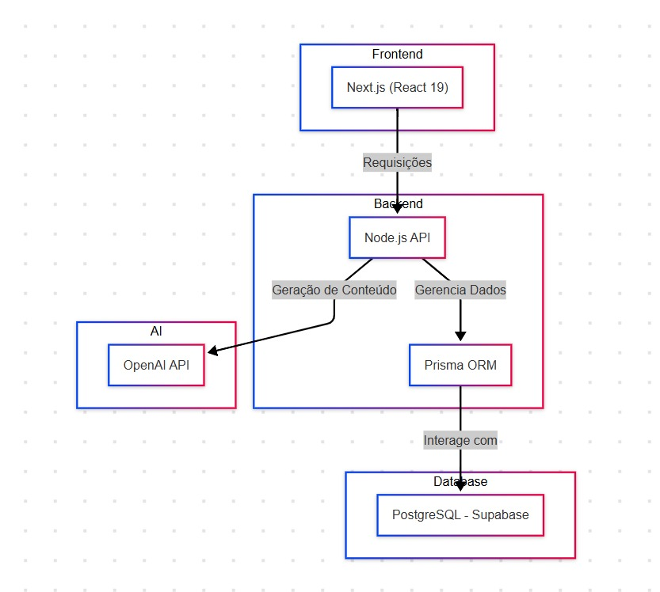
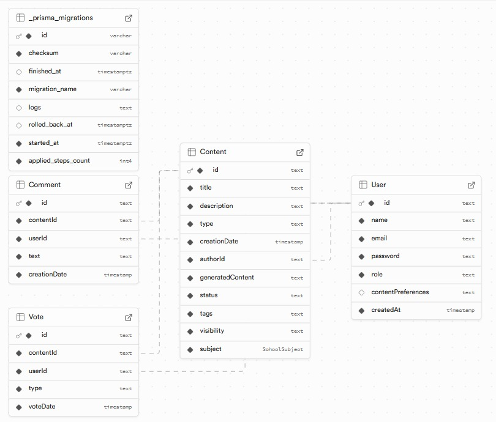

# EducaPro - Plataforma Educacional Inovadora

## 📌 Resumo Executivo

O **EducaPro** é uma plataforma educacional inovadora desenvolvida para **auxiliar professores da rede pública** na criação e compartilhamento de conteúdos didáticos de forma **dinâmica e eficiente**. Com o uso da **API da OpenAI**, a ferramenta permite a geração automática de materiais educativos, reduzindo o tempo gasto na preparação de aulas e garantindo conteúdos alinhados às necessidades pedagógicas.

A plataforma oferece suporte para a **exportação de materiais em diferentes formatos**:

- **Apresentações didáticas**: conteúdos estruturados no formato de **slides (PPT)** para facilitar exposições em sala de aula.
- **Materiais complementares e atividades**: conteúdos gerados são exportados em **PDF**, ideais para impressão, distribuição digital ou uso em plataformas de ensino.

Além da criação de materiais, o **EducaPro opera como uma comunidade colaborativa**, onde professores podem **compartilhar** suas aulas e recursos, permitindo que outros educadores **avaliem e votem** nos conteúdos mais relevantes. Esse mecanismo de **curadoria orgânica** garante que os materiais de maior qualidade sejam amplamente disseminados, criando um acervo vivo e evolutivo, semelhante a sistemas como o **Reddit**.

Com essa abordagem, o EducaPro não apenas simplifica o processo de criação de materiais didáticos, mas também fortalece a **troca de conhecimento entre educadores**, promovendo uma **rede de colaboração ativa** que impacta diretamente a qualidade da educação pública.

## 🛑 Problema Identificado

Os professores da **rede pública de ensino** enfrentam uma série de desafios na **criação de conteúdos didáticos** que sejam **engajadores, atualizados e eficazes** para seus alunos. Esses desafios se refletem diretamente na **qualidade da educação** e no **nível de aprendizado** dos estudantes. Entre os principais problemas identificados, destacam-se:

### 🔹 **1. Falta de Tempo para Criar Materiais de Qualidade**

Professores precisam conciliar **carga horária elevada**, atividades extracurriculares e correções de avaliações, o que reduz significativamente o tempo disponível para **planejar e produzir materiais didáticos inovadores**.

### 🔹 **2. Escassez de Recursos Tecnológicos e Ferramentas Adequadas**

Muitos professores não possuem acesso a **ferramentas que facilitem a criação de conteúdos didáticos**, tornando o processo manual, demorado e, muitas vezes, desatualizado. Além disso, a **infraestrutura limitada nas escolas públicas** dificulta o uso de metodologias ativas e materiais digitais.

### 🔹 **3. Dificuldade em Criar Aulas Dinâmicas e Motivadoras**

Aulas expositivas tradicionais, sem suporte de **recursos interativos** e materiais didáticos personalizados, tornam-se menos eficazes no engajamento dos alunos. Sem acesso a conteúdos modernos e adaptados à realidade da sala de aula, muitos professores enfrentam desafios em manter os alunos interessados e participativos.

### 🔹 **4. Falta de Compartilhamento e Colaboração Entre Professores**

Mesmo que um professor crie um material inovador, **não há um sistema eficiente** para que esse conteúdo seja compartilhado e reaproveitado por outros educadores. A falta de uma **rede de colaboração** impede que boas práticas e materiais de qualidade sejam disseminados na comunidade escolar.

### 🔹 **Impacto Direto no Ensino**

Essas dificuldades resultam em **aulas menos dinâmicas**, **menor retenção do conhecimento** por parte dos alunos e **desmotivação dos professores**, que acabam sobrecarregados e sem suporte adequado para inovar na educação.

O **EducaPro** surge como uma solução para enfrentar esses desafios, fornecendo uma plataforma **acessível, automatizada e colaborativa** que permite aos professores **criar, compartilhar e otimizar** materiais didáticos de forma eficiente.

## 💡 Descrição da Solução

O **EducaPro** é uma plataforma inovadora desenvolvida para **facilitar a criação, compartilhamento e otimização de conteúdos didáticos** para professores da rede pública. A solução combina **inteligência artificial**, **curadoria colaborativa** e **exportação flexível** para tornar o ensino mais dinâmico e acessível.

### 🔹 **1. Geração de Conteúdo Automatizada**

Através de um **formulário intuitivo**, os professores podem inserir informações básicas como:

- **Tema da aula**
- **Nível de ensino (fundamental, médio, etc.)**
- **Objetivos pedagógicos**
- **Tipo de conteúdo (atividade, resumo, apresentação, etc.)**

Com base nesses dados, a API da **OpenAI** gera automaticamente **materiais didáticos completos**, reduzindo significativamente o tempo necessário para produção de conteúdo.

### 🔹 **2. Exportação Flexível**

Os professores podem baixar os materiais criados nos seguintes formatos:

- **PDF**: Ideal para materiais complementares, resumos e atividades impressas ou digitais.
- **PPT (PowerPoint)**: Formato específico para **apresentações didáticas**, permitindo que os professores utilizem slides em suas aulas de forma prática e interativa.

### 🔹 **3. Plataforma Colaborativa**

O **EducaPro** não é apenas um gerador de conteúdo, mas também uma **comunidade de educadores**. Professores podem:

- **Compartilhar** suas aulas e materiais didáticos.
- **Avaliar e votar** nos conteúdos mais relevantes.
- **Comentar e trocar experiências** sobre diferentes abordagens pedagógicas.

Esse sistema de **curadoria colaborativa**, inspirado no funcionamento do **Reddit**, permite que os **melhores conteúdos ganhem destaque**, garantindo que materiais de qualidade sejam amplamente disseminados.

### 🔹 **4. Biblioteca de Conteúdos**

À medida que os professores compartilham e avaliam materiais, o EducaPro constrói um **acervo colaborativo** que:

- Organiza os materiais por **temas, disciplinas e níveis de ensino**.
- Permite que novos usuários acessem rapidamente **conteúdos validados e bem avaliados**.
- Facilita a **reutilização e aprimoramento** de conteúdos educacionais, reduzindo a sobrecarga dos professores.

## 🎯 **Impacto da Solução**

- **Economia de tempo** para os professores na preparação de aulas.
- **Melhoria na qualidade dos materiais didáticos**, através da curadoria coletiva.
- **Aulas mais dinâmicas e engajadoras**, incentivando a participação dos alunos.
- **Maior colaboração entre educadores**, fortalecendo a rede de ensino.

O **EducaPro** transforma a forma como professores criam e compartilham conhecimento, impulsionando a inovação na educação pública! 🚀

## 🏗 Processo de Desenvolvimento

O desenvolvimento do **EducaPro** seguiu um fluxo estruturado, baseado em metodologias ágeis e focado na **resolução dos desafios enfrentados pelos professores da rede pública**. As principais etapas foram:

### 🔹 **1. Pesquisa e Design Thinking**

- **Mapeamento dos desafios** enfrentados por professores na criação de materiais didáticos.
- **Entrevistas e levantamentos** para entender as necessidades reais dos docentes.
- **Definição de personas** para garantir que a solução atendesse diferentes perfis de professores.

### 🔹 **2. Brainstorming**

- Geração de ideias para solucionar o problema da **falta de tempo e dificuldade na criação de conteúdo**.
- Discussão sobre como utilizar **inteligência artificial e colaboração entre professores** para otimizar o ensino.
- Seleção da melhor abordagem para **automatizar a criação de materiais didáticos** e incentivar a troca de conhecimento.

### 🔹 **3. Desenvolvimento do MVP**

A primeira versão funcional do **EducaPro** foi construída com foco em **eficiência, acessibilidade e colaboração**:

- **Frontend e backend desenvolvidos com Next.js**, garantindo uma interface dinâmica e responsiva.
- **Banco de dados PostgreSQL no Supabase**, utilizado para armazenamento e gerenciamento de dados.
- **ORM Prisma**, facilitando a interação entre a aplicação e o banco de dados.
- **API de geração de conteúdo integrada com OpenAI**, permitindo a criação automatizada de materiais didáticos.
- Implementação do **sistema de curadoria**, onde professores podem compartilhar, avaliar e votar nos melhores conteúdos.

### 🔹 **4. Iteração**

- Ajustes no fluxo de criação de conteúdo e na interface para melhorar a experiência do usuário.
- Refinamento da lógica de **curadoria colaborativa**, garantindo que os melhores materiais se destaquem.

## 🛠 Detalhes Técnicos e Arquitetura

O **EducaPro** foi desenvolvido utilizando tecnologias modernas e escaláveis para garantir **eficiência, performance e colaboração**. A aplicação foi projetada para oferecer uma experiência intuitiva, com backend robusto e um banco de dados otimizado.

### 🔹 **Tecnologias Utilizadas**

- **Frontend**: Desenvolvido com **React 19 + Next.js 15**, proporcionando uma experiência fluida e otimizada.
- **Backend**: Construído em **Node.js** com **Prisma ORM**, permitindo fácil gerenciamento de dados.
- **Banco de Dados**: Utiliza **PostgreSQL no Supabase**, garantindo escalabilidade e alta disponibilidade.
- **UI**: **Material UI**, garantindo um design moderno e responsivo.
- **Geração de Conteúdo**: Integrado com **OpenAI API** para criação automatizada de materiais didáticos.
- **Exportação de Arquivos**:
  - **PDF**: jsPDF
  - **PPT (Apresentações)**: pptxgenjs
- **Validação de Formulários**: Implementada com **Zod + Formik** para garantir a integridade dos dados.

### 🔹 **Arquitetura do Sistema**

O **EducaPro** segue uma **arquitetura modular e escalável**, permitindo que professores utilizem a plataforma de forma intuitiva e eficiente. A estrutura foi inspirada em sistemas colaborativos como **Reddit**, possibilitando a votação e compartilhamento de conteúdos.

- **Frontend**: Next.js gerencia a renderização eficiente, garantindo um desempenho otimizado.
- **Backend**: API REST em **Node.js**, responsável pela lógica de negócios e comunicação com o banco de dados.
- **Banco de Dados**: **PostgreSQL no Supabase**, gerenciando conteúdos, usuários e interações na plataforma.
- **Integração com OpenAI**: Responsável pela **geração de conteúdo automatizada**.
- **Sistema de Curadoria e Votação**: Inspirado no **Reddit**, onde os melhores conteúdos são destacados com base na interação da comunidade.

## 📚 Aprendizados e Próximos Passos

O desenvolvimento do **EducaPro** trouxe diversos insights sobre **tecnologia, colaboração e inovação na educação**. Durante o processo, enfrentamos desafios técnicos e conceituais que nos ajudaram a refinar a solução, garantindo maior **usabilidade, impacto e escalabilidade**.

### ✅ **Principais Aprendizados**

- **Experiência do Usuário (UX) é fundamental** 📌  
  Professores possuem diferentes níveis de familiaridade com tecnologia. Criar um fluxo intuitivo e **acessível** foi essencial para garantir a adoção da plataforma.
- **O poder das comunidades colaborativas** 🤝  
  A possibilidade de compartilhar, avaliar e votar em conteúdos **incentiva o engajamento** e melhora a curadoria dos materiais educacionais, tornando a plataforma um ambiente vivo e autossustentável.

- **IA Generativa precisa de refinamento constante** 🤖  
  A integração com a **OpenAI** trouxe desafios, como a **garantia de qualidade dos conteúdos gerados** e a **adaptação da IA às necessidades pedagógicas**. Melhorar os prompts e personalizar a geração de conteúdos foram passos importantes.

- **Desafios na implementação do sistema de curadoria** 🏆  
  Projetar um mecanismo eficiente de **votação e ranqueamento** dos melhores conteúdos exigiu testes iterativos para garantir que **os materiais mais relevantes fossem destacados** de forma justa e transparente.

### 🚀 **Próximos Passos e Melhorias Futuras**

Para aumentar o impacto do **EducaPro**, planejamos evoluir com as seguintes melhorias:

1️⃣ **🔍 Personalização do Conteúdo**

- Implementar um **sistema de recomendação** para sugerir materiais didáticos com base no perfil do professor e no nível de ensino.

2️⃣ **📊 Feedback Automático da IA**

- Criar um sistema onde professores possam **receber sugestões** de aprimoramento para seus materiais, baseadas em padrões de ensino eficazes.

3️⃣ **📡 Integração com Plataformas Educacionais**

- Conectar o EducaPro com **Google Classroom, Moodle e outras ferramentas de ensino** para facilitar o uso no dia a dia dos professores.

4️⃣ **📥 Funcionalidade Offline**

- Permitir que professores baixem conteúdos e os utilizem **mesmo sem conexão com a internet**, garantindo acessibilidade em locais com infraestrutura limitada.

Com essas melhorias, o **EducaPro** continuará evoluindo como uma ferramenta essencial para a educação pública, ajudando professores a **criar aulas mais dinâmicas e acessíveis**! 🚀📚

## 🔗 Links Úteis

- **🚀 Acesse a Plataforma EducaPro:** [EducaPro - Deploy](https://fiap-postech-tcc.vercel.app/)

### 🔹 **Diagramas**

#### **📊 Arquitetura do Sistema**

#### **🗄️ Estrutura do Banco de Dados**

---

📅 **Hackathon FIAP - 2025**
